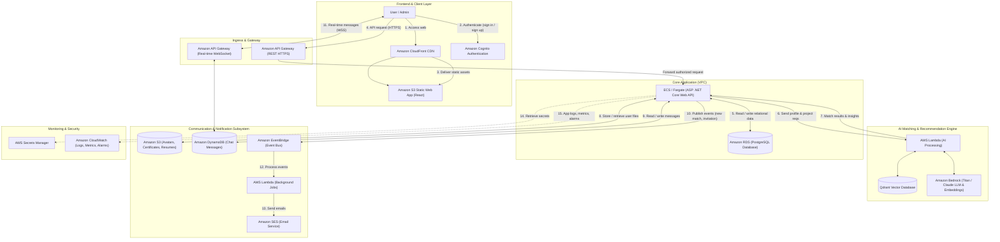

# TINDY PLATFORM — COMPREHENSIVE REST & WEBSOCKET API SPECIFICATION
**Version:** 2.2.0 (AWS Cloud Enterprise Architecture Aligned)  
**Base REST URL:** `https://api.tindy.fcaj.community/api/v1` (Amazon API Gateway / ECS Fargate ASP.NET)  
**Base WebSocket URL:** `wss://chat.tindy.fcaj.community` (`wss://{api-id}.execute-api.{region}.amazonaws.com/prod`)  
**Cloud Infrastructure:** AWS Cloud (VPC, ECS Fargate, RDS PostgreSQL, DynamoDB, Bedrock, Qdrant, EventBridge, Lambda, SES, S3, CloudFront, Cognito)  
**Security:** AWS Cognito User Pools + JWT Bearer Tokens (`Authorization: Bearer <token>`) + RBAC (Role-Based Access Control: `USER`, `ADMIN`)  

---

## 1. HỆ THỐNG KIẾN TRÚC AWS CLOUD & QUY ƯỚC CHUNG (AWS CLOUD ARCHITECTURE)

### 1.1. Sơ đồ Kiến trúc Tổng thể (Architecture Diagram Mapping)
Hệ thống Tindy được thiết kế trên nền tảng **AWS Cloud (VPC Multi-AZ)**, phân tách các tầng rõ ràng theo mô hình microservices & event-driven:



---

### 1.2. Bảng Ánh xạ 15 Luồng Tương tác trên Mô hình AWS (15-Step Interaction Matrix)

| Bước (#) | Tên luồng (Flow Name) | Nguồn (Source) | Đích (Destination) | Giao thức / Cơ chế | Vai trò nghiệp vụ trong Tindy |
| :---: | :--- | :--- | :--- | :--- | :--- |
| **1** | **Access web** | User / Admin | CloudFront CDN | HTTPS / HTTP/3 | Phân phối ứng dụng React SPA toàn cầu với độ trễ cực thấp và caching tối ưu. |
| **2** | **Authenticate** | User / Admin | AWS Cognito | HTTPS / OIDC | Xác thực đăng ký (`SignUp`), đăng nhập (`InitiateAuth`), MFA, cấp phát JWT Tokens. |
| **3** | **Deliver Assets** | CloudFront | S3 Static Web | HTTPS / OAC | Kéo mã nguồn đóng gói (Vite React bundle, assets, icons) từ S3 Bucket bảo mật. |
| **4** | **API request** | React Frontend | API Gateway -> ECS | HTTPS (REST) | Cổng API tập trung, kiểm tra Cognito Authorizer, rate-limiting và chuyển tiếp vào ASP .NET. |
| **5** | **Read / write data** | ECS Fargate | Amazon RDS | TCP (Port 5432) | Đọc ghi dữ liệu có cấu trúc: Users, Projects, Positions, Applications, Audit Logs. |
| **6** | **AI Processing Req** | ECS Fargate | Lambda / Qdrant | gRPC / HTTPS | Gửi Profile dữ liệu và yêu cầu tuyển dụng để tính toán vector và phân tích AI. |
| **7** | **Match & Insights** | Lambda / Bedrock | ECS Fargate | HTTPS JSON | Trả về điểm phù hợp (Match Score), giải thích độ tương thích (Why Matches) và Skill Gap. |
| **8** | **Store user files** | Client / ECS | Amazon S3 | HTTPS (Presigned) | Lưu trữ Avatar, chứng chỉ (Certificates), CV/Resume, tài liệu đính kèm dự án. |
| **9** | **Chat Storage** | ECS / Lambda | Amazon DynamoDB | HTTPS AWS SDK | Đọc ghi lịch sử tin nhắn thời gian thực với độ trễ mili-giây và khả năng mở rộng vô hạn. |
| **10** | **Publish events** | ECS Fargate | EventBridge | EventBus PutEvents | Bắn sự kiện bất đồng bộ: `NewMatchEvent`, `ProjectInvitationEvent`, `ApplicationStatusEvent`. |
| **11** | **Real-time chat** | React Frontend | API Gateway WSS | WSS (WebSocket) | Kênh kết nối 2 chiều duy trì trạng thái online, gửi/nhận tin nhắn tức thì và typing indicators. |
| **12** | **Process events** | EventBridge | Lambda Jobs | Event Trigger | Định tuyến sự kiện theo Rules đến các hàm Lambda xử lý ngầm trong nền. |
| **13** | **Send emails** | Lambda Jobs | Amazon SES | HTTPS AWS SDK | Gửi email thông báo kích hoạt tài khoản, lời mời tham gia dự án, cảnh báo vi phạm. |
| **14** | **Retrieve secrets** | ECS Fargate | Secrets Manager | IAM Role / HTTPS | Lấy an toàn chuỗi kết nối RDS, Qdrant API Key, Cognito App Client Secret khi khởi động container. |
| **15** | **Logs & Alarms** | ECS / Gateway | CloudWatch | AWS SDK / Agent | Tập trung log ứng dụng ASP .NET, đo lường latency, CPU/RAM, và kích hoạt báo động. |

---

### 1.3. Bốn Đầu Ra Cốt Lõi của Hệ thống AI (AI Service 4 Core Outputs)
Theo đúng kiến trúc **AI Matching & Recommendation** trên sơ đồ:
1. **`AI Profile Summary`**: Phân tích toàn diện hồ sơ ứng viên (Bio, Kinh nghiệm, Dự án đã làm, Chứng chỉ) thành bản tóm tắt chuyên môn sắc bén thông qua Bedrock LLM.
2. **`Skill Extraction`**: Bóc tách tự động các kỹ năng cốt lõi (Hard skills, Soft skills, Tech stack, Tools) từ văn bản tự do và CV ứng viên.
3. **`Project Matching`**: Tính toán khoảng cách cosine giữa vector ứng viên và vector yêu cầu dự án trong **Qdrant Vector Database**, kết hợp trọng số heuristic thành điểm Match Score (0 - 100%).
4. **`Explain Match`**: Mô hình Bedrock LLM sinh lời giải thích minh bạch chi tiết vì sao ứng viên phù hợp với dự án (Strengths, Gap Analysis, Technical Overlap).

---

### 1.4. HTTP Status Codes
- `200 OK`: Thành công (GET, PUT, PATCH).
- `201 Created`: Tạo tài nguyên mới thành công (POST).
- `204 No Content`: Xóa hoặc thực thi hành động không cần payload trả về (DELETE).
- `400 Bad Request`: Payload không hợp lệ hoặc thiếu trường bắt buộc.
- `401 Unauthorized`: Token hết hạn, sai hoặc chưa đăng nhập.
- `403 Forbidden`: Người dùng không có quyền truy cập tài nguyên (RBAC).
- `404 Not Found`: Không tìm thấy tài nguyên.
- `409 Conflict`: Trùng lặp dữ liệu (Email đã đăng ký, vị trí đã đủ số lượng, v.v.).
- `422 Unprocessable Entity`: Dữ liệu vi phạm logic nghiệp vụ (Matching rule validation, v.v.).
- `500 Internal Server Error`: Lỗi máy chủ nội bộ.

### 1.5. Định dạng Response chuẩn (Standard Response Envelope)
#### Phản hồi thành công (Success Response):
```json
{
  "success": true,
  "statusCode": 200,
  "message": "Operation completed successfully",
  "data": { ... },
  "metadata": {
    "page": 1,
    "limit": 20,
    "totalItems": 142,
    "totalPages": 8
  },
  "timestamp": "2026-10-07T08:30:00.000Z"
}
```

#### Phản hồi lỗi chuẩn (RFC 7807 Error Response):
```json
{
  "success": false,
  "statusCode": 400,
  "error": "BAD_REQUEST",
  "message": "Validation failed on input payload",
  "details": [
    {
      "field": "weeklyCommitment",
      "issue": "Weekly commitment must be between 4 and 40 hours"
    }
  ],
  "timestamp": "2026-10-07T08:30:00.000Z",
  "path": "/api/v1/projects"
}
```

### 1.6. Hệ thống phân quyền người dùng (Role-Based Access Control — RBAC)
Nền tảng Tindy thiết kế tinh giản và phân định quyền hạn rõ ràng thành **2 Roles chính thống**:

1. **`USER` (Người dùng nền tảng hợp nhất)**:
   - **Tư cách Thành viên / Ứng viên (Collaborator / Candidate)**: Tìm kiếm dự án, xem phân tích AI fit score, gửi yêu cầu quan tâm (Interested), bookmark dự án (Save for later), tham gia nhóm dự án và trò chuyện trao đổi.
   - **Tư cách Chủ nhiệm / Sáng lập dự án (Project Owner / Lead)**: Bất kỳ người dùng `USER` nào cũng có toàn quyền tạo dự án mới, đăng tin tuyển mộ thành viên cho các vị trí mở, duyệt ứng viên (Shortlist / Invite), phân công nhiệm vụ và quản lý tiến độ nhóm.
   - Không còn sự chia rẽ cứng nhắc giữa role "Leader" và role "Candidate" — mọi thành viên trong cộng đồng đều có thể vừa cống hiến chuyên môn cho dự án người khác, vừa tự mình dẫn dắt dự án riêng.

2. **`ADMIN` (Quản trị viên hệ thống)**:
   - Quản trị toàn bộ người dùng: Khóa/mở khóa tài khoản, cấp trạng thái xác thực học thuật (Verified Badges), thăng/hạ cấp quyền tài khoản.
   - Kiểm duyệt nội dung dự án: Phê duyệt, gắn cờ cảnh báo (Flag), gỡ bỏ dự án vi phạm tiêu chuẩn cộng đồng, gắn nhãn dự án nổi bật (Feature/Pin).
   - Quản trị thuật toán AI: Điều chỉnh trọng số scoring heuristic (Technical Skills, Interest, Role Alignment, Experience, Availability).
   - Quản lý danh sách trường đại học & email domain được chấp thuận (Institutional Domain Whitelist).
   - Giám sát hệ thống: Xem audit logs, throughput kết nối WebSocket và báo cáo số liệu toàn hệ thống.

---

## 2. NHÓM 1: AUTHENTICATION & ACCESS CONTROL (XÁC THỰC & BẢO MẬT — AWS COGNITO)

Hệ thống xác thực Tindy sử dụng **Amazon Cognito User Pools** (Bước ② trên sơ đồ kiến trúc), kết hợp 2 phương thức truy cập linh hoạt:
- **Phương thức A (Direct Client SDK via AWS Amplify / Cognito Identity Provider):** Client giao tiếp trực tiếp với Cognito Endpoint để lấy Tokens, giảm tải hoàn toàn cho backend.
- **Phương thức B (BFF Proxy REST Endpoints via ASP .NET Core):** Cung cấp các API REST chuẩn hóa bên dưới dành cho các tác vụ cần xác thực thêm quy tắc học thuật (FCAJ Community Whitelist) trước khi đăng ký người dùng vào Cognito.

### 2.1. Cấu hình Cognito User Pool & Claims
- **User Pool ID:** `ap-southeast-1_TindyPool99`
- **App Client ID:** `4k8j2a901h1q88bcdef`
- **JWKS Endpoint:** `https://cognito-idp.ap-southeast-1.amazonaws.com/ap-southeast-1_TindyPool99/.well-known/jwks.json`
- **Custom Attributes:**
  - `custom:university` (String): Tên trường đại học đã liên kết (vd: `FPT University`).
  - `custom:student_id` (String): Mã số sinh viên.
  - `custom:is_verified` (Boolean): Trạng thái xác thực học thuật.
- **Cognito Groups (RBAC):**
  - Group `USER`: Mặc định cho toàn bộ thành viên đăng ký mới.
  - Group `ADMIN`: Quản trị viên hệ thống có quyền truy cập cụm API Admin.

---

### `POST /api/v1/auth/register`
- **Mô tả:** Đăng ký tài khoản người dùng mới (Ủy quyền tạo tài khoản trong Amazon Cognito User Pool và gán vào nhóm `USER`).
- **Quyền:** Public.
- **Request Body:**
  ```json
  {
    "fullName": "Alex Le",
    "email": "alex.le@fpt.edu.vn",
    "password": "StrongPassword123!",
    "confirmPassword": "StrongPassword123!",
    "university": "FPT University",
    "acceptTerms": true
  }
  ```
  *(Lưu ý: Mọi tài khoản mới đăng ký qua cổng public đều tự động gán role `"USER"`).*
- **Response `201 Created`:**
  ```json
  {
    "user": {
      "id": "usr_9981",
      "cognitoSub": "c56a4180-65aa-42ec-a945-5fd21dec0538",
      "email": "alex.le@fpt.edu.vn",
      "fullName": "Alex Le",
      "role": "USER",
      "isEmailVerified": false
    },
    "tokens": {
      "idToken": "eyJraWQiOi...",
      "accessToken": "eyJhbGciOi...",
      "refreshToken": "d8a1c90..."
    }
  }
  ```

### `POST /api/v1/auth/login`
- **Mô tả:** Đăng nhập bằng email và mật khẩu.
- **Quyền:** Public.
- **Request Body:**
  ```json
  {
    "email": "alex.le@fpt.edu.vn",
    "password": "StrongPassword123!",
    "rememberMe": true
  }
  ```
- **Response `200 OK`:**
  ```json
  {
    "user": {
      "id": "usr_9981",
      "email": "alex.le@fpt.edu.vn",
      "fullName": "Alex Le",
      "role": "USER",
      "avatarUrl": "https://cdn.fcaj.community/avatars/alex.png",
      "isEmailVerified": true
    },
    "tokens": {
      "accessToken": "eyJhbGciOi...",
      "refreshToken": "d8a1c90...",
      "expiresIn": 900
    }
  }
  ```

### `POST /api/v1/auth/refresh-token`
- **Mô tả:** Cấp mới Access Token khi token cũ hết hạn (15 phút).
- **Quyền:** Public (Kèm Refresh Token hợp lệ).
- **Request Body:**
  ```json
  {
    "refreshToken": "d8a1c90..."
  }
  ```
- **Response `200 OK`:**
  ```json
  {
    "accessToken": "eyJhbGciOi...",
    "expiresIn": 900
  }
  ```

### `POST /api/v1/auth/logout`
- **Mô tả:** Đăng xuất, hủy bỏ Refresh Token và thu hồi phiên làm việc.
- **Quyền:** Bearer Token.
- **Response `200 OK`:**
  ```json
  {
    "message": "Successfully logged out of all active sessions"
  }
  ```

### `POST /api/v1/auth/forgot-password`
- **Mô tả:** Gửi email hướng dẫn đặt lại mật khẩu kèm mã OTP / Reset Token.
- **Quyền:** Public.
- **Request Body:**
  ```json
  {
    "email": "alex.le@fpt.edu.vn"
  }
  ```
- **Response `200 OK`:**
  ```json
  {
    "message": "Password reset instructions sent to institutional email address"
  }
  ```

### `POST /api/v1/auth/reset-password`
- **Mô tả:** Xác thực token reset và cập nhật mật khẩu mới.
- **Quyền:** Public.
- **Request Body:**
  ```json
  {
    "resetToken": "rst_token_8812",
    "newPassword": "NewStrongPassword456!",
    "confirmPassword": "NewStrongPassword456!"
  }
  ```
- **Response `200 OK`:**
  ```json
  {
    "message": "Password updated successfully. You can now sign in."
  }
  ```

### `POST /api/v1/auth/verify-email`
- **Mô tả:** Xác thực quyền sở hữu email trường đại học.
- **Quyền:** Public.
- **Request Body:**
  ```json
  {
    "token": "verify_token_123"
  }
  ```
- **Response `200 OK`:**
  ```json
  {
    "isEmailVerified": true,
    "message": "Institutional email verified successfully"
  }
  ```

---

## 3. NHÓM 2: ONBOARDING WIZARD (THIẾT LẬP BAN ĐẦU)

### `GET /api/v1/onboarding/status`
- **Mô tả:** Lấy tiến độ wizard onboarding của tài khoản (Current Step, Completion %).
- **Quyền:** Bearer Token (`USER`, `ADMIN`).
- **Response `200 OK`:**
  ```json
  {
    "completed": false,
    "currentStep": 2,
    "totalSteps": 4,
    "completedSteps": ["IDENTITY_SETUP", "ACADEMIC_CREDENTIALS"],
    "pendingSteps": ["SKILLS_EXPERIENCE", "AI_PREFERENCES"]
  }
  ```

### `POST /api/v1/onboarding/step`
- **Mô tả:** Lưu tiến độ và dữ liệu từng bước trong wizard onboarding.
- **Quyền:** Bearer Token (`USER`).
- **Request Body:**
  ```json
  {
    "step": 3,
    "preferredRole": "Backend Developer",
    "skills": [".NET", "AWS", "PostgreSQL", "React"],
    "weeklyAvailabilityHours": 10,
    "projectInterests": ["AI Customer Support", "Cloud Infrastructure"]
  }
  ```
- **Response `200 OK`:**
  ```json
  {
    "step": 3,
    "saved": true
  }
  ```

### `POST /api/v1/onboarding/complete`
- **Mô tả:** Đánh dấu hoàn thành toàn bộ onboarding và kích hoạt Discovery Engine.
- **Quyền:** Bearer Token (`USER`).
- **Response `200 OK`:**
  ```json
  {
    "onboardingCompleted": true,
    "redirectUrl": "/dashboard"
  }
  ```

---

## 4. NHÓM 3: USER PROFILE & CREDENTIALS (QUẢN LÝ HỒ SƠ)

### `GET /api/v1/profile/me`
- **Mô tả:** Lấy toàn bộ thông tin hồ sơ của người dùng đang đăng nhập.
- **Quyền:** Bearer Token (`USER`, `ADMIN`).
- **Response `200 OK`:**
  ```json
  {
    "id": "usr_alex_le",
    "name": "Alex Le",
    "university": "FPT University",
    "email": "alex.le@fpt.edu.vn",
    "role": "USER",
    "preferredRole": "Backend Developer",
    "hours": "10",
    "interests": "Cloud computing, AI applications, open source",
    "skills": [".NET", "AWS", "PostgreSQL", "React", "TypeScript", "Git"],
    "summary": "Backend-focused developer with hands-on experience in .NET, AWS, and PostgreSQL...",
    "github": "github.com/alexle",
    "portfolio": "alexle.dev",
    "avatarUrl": "https://cdn.fcaj.community/avatars/alex.png",
    "profileStrength": 85,
    "technologies": "Docker, AWS Lambda, EventBridge",
    "verified": true
  }
  ```

### `PUT /api/v1/profile/me`
- **Mô tả:** Cập nhật thông tin profile cá nhân (Bio, Roles, Kỹ năng, Liên kết).
- **Quyền:** Bearer Token (`USER`, `ADMIN`).
- **Request Body:**
  ```json
  {
    "preferredRole": "Backend Developer",
    "hours": "12",
    "interests": "Cloud computing, RAG, Large Language Models",
    "summary": "Updated bio...",
    "github": "https://github.com/alexle",
    "portfolio": "https://alexle.dev"
  }
  ```
- **Response `200 OK`:** Profile đã cập nhật.

### `POST /api/v1/profile/me/avatar`
- **Mô tả:** Tải lên ảnh đại diện cá nhân (Multipart Form Data).
- **Quyền:** Bearer Token (`USER`, `ADMIN`).
- **Payload:** `multipart/form-data` with `file: image/png|jpeg` (Max 5MB).
- **Response `200 OK`:**
  ```json
  {
    "avatarUrl": "https://cdn.fcaj.community/avatars/alex_17912.jpg"
  }
  ```

### `GET /api/v1/profile/:userId`
- **Mô tả:** Lấy thông tin public profile của thành viên bất kỳ.
- **Quyền:** Bearer Token (`USER`, `ADMIN`).
- **Response `200 OK`:** Thông tin chi tiết, verified badges, past projects, certificates.

### `GET /api/v1/profile/me/experiences`
- **Mô tả:** Lấy danh sách các dự án thực chiến trước đây trong hồ sơ (Previous Projects).
- **Quyền:** Bearer Token (`USER`, `ADMIN`).
- **Response `200 OK`:**
  ```json
  [
    {
      "id": "exp_1",
      "name": "RAG Support Chatbot",
      "role": "Backend Developer",
      "desc": "Built an intelligent university knowledge assistant using .NET 8, PostgreSQL pgvector and AWS Bedrock.",
      "tech": [".NET 8", "AWS", "pgvector", "FastAPI"],
      "repoUrl": "https://github.com/alexle/rag-support",
      "startDate": "2025-09",
      "endDate": "2025-12"
    }
  ]
  ```

### `POST /api/v1/profile/me/experiences`
- **Mô tả:** Thêm kinh nghiệm dự án mới vào hồ sơ cá nhân.
- **Quyền:** Bearer Token (`USER`, `ADMIN`).
- **Request Body:**
  ```json
  {
    "name": "Ticket Management Microservice",
    "role": "Backend Engineer",
    "desc": "Implemented event-driven ticket dispatcher with AWS EventBridge & Lambda.",
    "tech": [".NET", "AWS EventBridge", "Docker"],
    "repoUrl": "https://github.com/alexle/ticket-service"
  }
  ```
- **Response `201 Created`:** Object kinh nghiệm mới kèm ID.

### `PUT /api/v1/profile/me/experiences/:expId`
- **Mô tả:** Cập nhật thông tin dự án kinh nghiệm.
- **Quyền:** Bearer Token (`USER`, `ADMIN`).
- **Response `200 OK`:** Kinh nghiệm sau sửa đổi.

### `DELETE /api/v1/profile/me/experiences/:expId`
- **Mô tả:** Xóa dự án kinh nghiệm khỏi hồ sơ.
- **Quyền:** Bearer Token (`USER`, `ADMIN`).
- **Response `204 No Content`**.

### `GET /api/v1/profile/me/certificates`
- **Mô tả:** Lấy danh sách chứng chỉ học thuật đã xác minh (Verified Academic Credentials).
- **Quyền:** Bearer Token (`USER`, `ADMIN`).
- **Response `200 OK`:**
  ```json
  [
    {
      "id": "cert_1",
      "title": "AWS Certified Cloud Practitioner",
      "issuer": "Amazon Web Services",
      "credentialId": "AWS-CLF-89211",
      "issueDate": "2025-11",
      "verified": true
    }
  ]
  ```

### `POST /api/v1/profile/me/certificates`
- **Mô tả:** Đăng ký chứng chỉ mới để hệ thống kiểm duyệt.
- **Quyền:** Bearer Token (`USER`, `ADMIN`).
- **Request Body:**
  ```json
  {
    "title": "Meta Front-End Developer Specialization",
    "issuer": "Coursera / Meta",
    "credentialUrl": "https://coursera.org/verify/META99"
  }
  ```
- **Response `201 Created`**.

### `POST /api/v1/profile/me/resume/upload`
- **Mô tả:** Tải lên file CV / Resume (PDF) để AI phân tích trích xuất kỹ năng.
- **Quyền:** Bearer Token (`USER`, `ADMIN`).
- **Payload:** `multipart/form-data` with `file: application/pdf`.
- **Response `200 OK`:** File URL, extracted metadata.

---

## 5. NHÓM 4: DASHBOARD & WORKSPACE OVERVIEW (TỔNG QUAN)

### `GET /api/v1/dashboard/metrics`
- **Mô tả:** Lấy các chỉ số thống kê trên Dashboard cá nhân.
- **Quyền:** Bearer Token (`USER`, `ADMIN`).
- **Response `200 OK`:**
  ```json
  {
    "activeProjectsCount": 2,
    "pendingInvitationsCount": 1,
    "averageMatchScore": 92,
    "savedOpportunitiesCount": 4,
    "weeklyCommittedHours": 18,
    "profileCompleteness": 85
  }
  ```

### `GET /api/v1/dashboard/featured-opportunity`
- **Mô tả:** Lấy cơ hội dự án nổi bật được thuật toán đề xuất cho người dùng.
- **Quyền:** Bearer Token (`USER`, `ADMIN`).
- **Response `200 OK`:**
  ```json
  {
    "id": "ecotrack",
    "name": "EcoTrack Sustainability Initiative",
    "category": "Social Impact · Environmental",
    "headline": "Formal team invitation received from Jamie Le",
    "commitment": "10-12 hrs/week",
    "role": "Frontend Developer",
    "matchScore": 90,
    "actionType": "INVITATION"
  }
  ```

### `GET /api/v1/dashboard/recommended-feed`
- **Mô tả:** Lấy danh sách dự án đề xuất theo độ phù hợp (High Match, Quick Sprint, Beginners).
- **Query Params:** `tab=recommended|recent|starred`, `limit=6`.
- **Response `200 OK`:** Mảng các đối tượng `ProjectItem`.

### `GET /api/v1/dashboard/next-steps`
- **Mô tả:** Lấy danh sách các gợi ý hành động tiếp theo (Next Steps Checklist).
- **Quyền:** Bearer Token (`USER`, `ADMIN`).
- **Response `200 OK`:**
  ```json
  [
    {
      "id": "step_1",
      "title": "Review EcoTrack Invitation",
      "description": "Jamie Le sent you an offer for Frontend Developer (10 hrs/week).",
      "actionUrl": "/projects?tab=Invited",
      "type": "INVITE"
    },
    {
      "id": "step_2",
      "title": "Add Docker to verified skills",
      "description": "3 high-matching projects require containerization knowledge.",
      "actionUrl": "/ai-studio",
      "type": "SKILL_GAP"
    }
  ]
  ```

---

## 6. NHÓM 5: DISCOVERY ENGINE & SWIPE DECK (KHÁM PHÁ & THUẬT TOÁN AI)

### `GET /api/v1/discovery/projects`
- **Mô tả:** Lấy bộ thẻ bài dự án cho giao diện Swipe Deck (Dành cho User tìm kiếm dự án để tham gia).
- **Quyền:** Bearer Token (`USER`, `ADMIN`).
- **Query Params:**
  - `role`: e.g. `Backend Developer`, `All`
  - `skill`: e.g. `AWS`, `All`
  - `minScore`: e.g. `0`, `35`, `65`, `100`
  - `page`: e.g. `1`
  - `limit`: e.g. `10`
- **Response `200 OK`:**
  ```json
  {
    "projects": [
      {
        "id": "proj-1",
        "name": "AI Customer Support System",
        "tagline": "RAG-driven contextual query agent",
        "desc": "Build an AI-powered customer support platform using RAG and cloud services...",
        "category": "AI & Cloud Infrastructure",
        "role": "Backend Developer",
        "skills": [".NET", "AWS", "PostgreSQL", "RAG", "LLM"],
        "niceToHave": ["Docker", "Redis"],
        "hours": "10 hrs/week",
        "duration": "3 months",
        "teamSize": 3,
        "maxTeamSize": 5,
        "teamMembers": [
          { "name": "Minh Nguyen", "role": "Lead Architect", "avatar": "https://cdn.fcaj.community/avatars/minh.png", "initials": "MN" }
        ],
        "goals": ["Build retrieval-augmented knowledge base", "Deploy scalable API on AWS"],
        "techStack": [".NET 8", "AWS Bedrock", "PostgreSQL", "Docker"],
        "leadName": "Minh Nguyen",
        "leadRole": "Lead Architect",
        "leadAvatar": "https://cdn.fcaj.community/avatars/minh.png",
        "color": "violet",
        "match": {
          "overall": 92,
          "verdict": "Excellent Match",
          "factors": [
            { "label": "Technical Skills", "weight": 40, "score": 90, "detail": "Strong alignment in .NET, AWS and PostgreSQL" },
            { "label": "Interest Match", "weight": 20, "score": 95, "detail": "Targeted domain interest in AI applications" },
            { "label": "Preferred Role", "weight": 15, "score": 100, "detail": "Perfect fit for Backend Developer" },
            { "label": "Past Experience", "weight": 15, "score": 80, "detail": "Prior work on RAG chatbot" },
            { "label": "Availability", "weight": 10, "score": 100, "detail": "10 hrs/week requested and supplied" }
          ],
          "strongMatches": [".NET Core", "AWS S3 / Bedrock", "PostgreSQL"],
          "skillGaps": [
            { "skill": "Docker", "note": "Basic container knowledge desired for deployment", "recommendation": "Review Docker compose fundamentals" }
          ],
          "explanationSummary": "Alex has proven hands-on experience in .NET backend development and AWS..."
        }
      }
    ],
    "totalCount": 24
  }
  ```

### `GET /api/v1/discovery/candidates`
- **Mô tả:** Lấy bộ thẻ bài ứng viên/đồng đội cho giao diện Swipe Deck (Dành cho User tìm đồng đội cho dự án của mình).
- **Quyền:** Bearer Token (`USER`, `ADMIN`).
- **Query Params:** `role`, `skill`, `minScore`, `page`, `limit`.
- **Response `200 OK`:** Mảng các đối tượng `DiscoveryCandidate` kèm đầy đủ `match breakdown`.

### `POST /api/v1/discovery/swipe`
- **Mô tả:** Ghi nhận hành động swipe (Left: Skip, Right: Interested/Shortlist, Up: Save).
- **Quyền:** Bearer Token (`USER`, `ADMIN`).
- **Request Body:**
  ```json
  {
    "itemId": "proj-1",
    "itemType": "PROJECT",
    "direction": "RIGHT",
    "note": "Interested in Backend position"
  }
  ```
- **Response `200 OK`:**
  ```json
  {
    "actionRecorded": true,
    "status": "INTERESTED",
    "timestamp": 1791278100000
  }
  ```

### `POST /api/v1/discovery/undo`
- **Mô tả:** Hoàn tác hành động swipe cuối cùng trong stack (Ctrl+Z hoặc nút Undo).
- **Quyền:** Bearer Token (`USER`, `ADMIN`).
- **Response `200 OK`:**
  ```json
  {
    "restoredItemId": "proj-1",
    "message": "Last swipe action successfully reversed"
  }
  ```

### `POST /api/v1/discovery/reset-stack`
- **Mô tả:** Đặt lại toàn bộ stack khuyến nghị đã xem để duyệt lại từ đầu.
- **Quyền:** Bearer Token (`USER`, `ADMIN`).
- **Request Body:** `{ "mode": "projects" }` (hoặc `"candidates"`).
- **Response `200 OK`:** Reset thành công.

### `GET /api/v1/discovery/why-matches/:id`
- **Mô tả:** Lấy chi tiết giải trình AI phân tích độ phù hợp chuyên sâu (Explainable AI Modal).
- **Query Params:** `type=project|candidate`.
- **Response `200 OK`:**
  ```json
  {
    "overall": 94,
    "verdict": "Excellent Match",
    "factors": [
      { "label": "Technical Skills", "weight": 40, "score": 96, "detail": "96% technology compatibility" },
      { "label": "Interest Match", "weight": 20, "score": 95, "detail": "Aligned with AI & Cloud" },
      { "label": "Preferred Role", "weight": 15, "score": 100, "detail": "Exact Backend role match" },
      { "label": "Previous Experience", "weight": 15, "score": 80, "detail": "Direct project evidence found" },
      { "label": "Availability", "weight": 10, "score": 100, "detail": "10/10 weekly hours compatible" }
    ],
    "explanationSummary": "Based on verified university achievements and GitHub repository evidence, Alex is ranked in the top 8% of candidates for this position."
  }
  ```

### `GET /api/v1/discovery/filters`
- **Mô tả:** Lấy danh sách các Role, Skill và ngưỡng điểm khả dụng trong hệ thống.
- **Response `200 OK`:**
  ```json
  {
    "roles": ["All", "Backend Developer", "Frontend Developer", "AI Engineer", "Cloud Engineer", "Full-stack Developer", "UI/UX Designer"],
    "skills": ["All", ".NET", "React", "AWS", "PostgreSQL", "Python", "TypeScript", "Docker", "LLM", "Next.js"],
    "scoreThresholds": [0, 35, 65, 100]
  }
  ```

---

## 7. NHÓM 6: RECRUITMENT PIPELINE & FUNNEL TRACKING (TIẾN TRÌNH TUYỂN DỤNG)

### `GET /api/v1/pipeline/status/:entityType/:id`
- **Mô tả:** Lấy trạng thái phễu tuyển dụng hiện tại giữa User và dự án/ứng viên.
- **Quyền:** Bearer Token (`USER`, `ADMIN`).
- **Path Params:**
  - `entityType`: `project` hoặc `candidate`
  - `id`: ID của đối tượng
- **Response `200 OK`:**
  ```json
  {
    "currentStep": 2,
    "totalSteps": 5,
    "status": "SHORTLISTED",
    "timeline": [
      { "stage": "Interested", "completed": true, "timestamp": "2026-10-05T14:20:00Z" },
      { "stage": "Shortlisted", "completed": true, "timestamp": "2026-10-06T09:15:00Z" },
      { "stage": "Chatting", "completed": false, "timestamp": null },
      { "stage": "Invitation Sent", "completed": false, "timestamp": null },
      { "stage": "Joined", "completed": false, "timestamp": null }
    ]
  }
  ```

### `POST /api/v1/pipeline/candidates/:id/shortlist`
- **Mô tả:** Thêm ứng viên vào Shortlist (Dành cho chủ dự án) -> Chuyển funnel sang `Shortlisted`.
- **Quyền:** Role `USER` (Project Owner) hoặc `ADMIN`.
- **Response `200 OK`:**
  ```json
  {
    "candidateId": "cand-1",
    "currentStatus": "Shortlisted"
  }
  ```

### `POST /api/v1/pipeline/candidates/:id/invite`
- **Mô tả:** Gửi lời mời trực tiếp kèm thư nhắn mời ứng viên gia nhập -> Chuyển funnel sang `Invited`.
- **Quyền:** Role `USER` (Project Owner) hoặc `ADMIN`.
- **Request Body:**
  ```json
  {
    "candidateId": "cand-1",
    "projectId": "proj-1",
    "role": "Frontend Developer",
    "invitationMessage": "Hi Linh Tran, I reviewed your verified profile and would like to invite you to discuss our Frontend role for EcoTrack."
  }
  ```
- **Response `201 Created`:**
  ```json
  {
    "invitationId": "inv_8819",
    "status": "INVITATION_SENT",
    "notifiedAt": "2026-10-07T08:30:00Z"
  }
  ```

### `POST /api/v1/pipeline/invitations/:id/respond`
- **Mô tả:** Phản hồi lời mời gia nhập dự án (Chấp nhận hoặc Từ chối).
- **Quyền:** Role `USER` (Người nhận lời mời) hoặc `ADMIN`.
- **Request Body:**
  ```json
  {
    "action": "ACCEPT",
    "declineReason": null
  }
  ```
- **Response `200 OK`:**
  ```json
  {
    "status": "JOINED",
    "teamWorkspaceUrl": "/team"
  }
  ```

---

## 8. NHÓM 7: MY PROJECTS & WORKSPACE MANAGEMENT (QUẢN LÝ DỰ ÁN & SPRINT)

### `GET /api/v1/projects`
- **Mô tả:** Danh sách tìm kiếm dự án công khai có lọc và phân trang.
- **Query Params:** `q`, `category`, `role`, `tech`, `page`, `limit`.
- **Response `200 OK`:** Mảng các đối tượng `ProjectItem`.

### `GET /api/v1/projects/:id`
- **Mô tả:** Lấy thông tin chi tiết đầy đủ của một dự án (ProjectDetail Screen).
- **Response `200 OK`:** Thông tin chi tiết dự án, thành viên, vị trí tuyển dụng, mục tiêu sprint.

### `POST /api/v1/projects`
- **Mô tả:** Tạo dự án mới (Dành cho bất kỳ User nào có ý tưởng xây dựng sản phẩm).
- **Quyền:** Role `USER` hoặc `ADMIN`.
- **Request Body:**
  ```json
  {
    "name": "Smart Campus IoT Energy",
    "tagline": "Realtime classroom energy telemetry",
    "description": "Building IoT smart sensors network across building Alpha to optimize HVAC electrical consumption.",
    "category": "IoT · Sustainability",
    "role": "Lead Architect",
    "goals": [
      "Deploy 40 sensor nodes in Lecture Halls",
      "Build real-time MQTT data pipeline",
      "Develop public student web dashboard"
    ],
    "techStack": ["MQTT", "Node.js", "InfluxDB", "React"],
    "availableRoles": ["Hardware Specialist", "Frontend Developer"],
    "weeklyCommitment": 10,
    "duration": "3 months",
    "maxTeamSize": 5
  }
  ```
- **Response `201 Created`:**
  ```json
  {
    "id": "proj-smart-energy",
    "name": "Smart Campus IoT Energy",
    "ownerId": "usr_alex_le",
    "createdAt": "2026-10-07T08:30:00Z"
  }
  ```

### `PUT /api/v1/projects/:id`
- **Mô tả:** Cập nhật thông tin dự án.
- **Quyền:** Role `USER` (Project Owner) hoặc `ADMIN`.
- **Response `200 OK`:** Dự án đã cập nhật.

### `DELETE /api/v1/projects/:id`
- **Mô tả:** Xóa hoặc lưu trữ dự án.
- **Quyền:** Role `USER` (Project Owner) hoặc `ADMIN`.
- **Response `204 No Content`**.

### `GET /api/v1/projects/my-projects`
- **Mô tả:** Lấy danh sách dự án của người dùng theo tab (Active, Saved, Interested, Invited, Completed).
- **Query Params:** `status=active|saved|interested|invited|completed`.
- **Quyền:** Bearer Token (`USER`, `ADMIN`).
- **Response `200 OK`:**
  ```json
  {
    "active": [{ "id": "ecotrack", "name": "EcoTrack", "role": "Frontend Developer", "status": "In Progress" }],
    "saved": [{ "id": "campus-cloud", "name": "Campus Cloud" }],
    "interested": [{ "id": "studywise", "name": "StudyWise AI" }],
    "invited": [{ "id": "cloud-desk", "name": "AI Customer Support System" }],
    "completed": []
  }
  ```

### `POST /api/v1/projects/:id/save`
- **Mô tả:** Bookmark / Lưu dự án để xem lại sau (Toggle Save).
- **Quyền:** Bearer Token (`USER`, `ADMIN`).
- **Response `200 OK`:** `{ "isSaved": true }`.

### `GET /api/v1/projects/:id/members`
- **Mô tả:** Lấy danh sách thành viên nhóm của dự án.
- **Response `200 OK`:** Danh sách thành viên kèm vai trò và avatar.

### `DELETE /api/v1/projects/:id/members/:userId`
- **Mô tả:** Xóa thành viên khỏi nhóm dự án.
- **Quyền:** Role `USER` (Project Owner) hoặc `ADMIN`.
- **Response `200 OK`:** Thành viên đã được gỡ bỏ.

### `GET /api/v1/projects/:id/announcements`
- **Mô tả:** Lấy danh sách thông báo nội bộ dự án.
- **Response `200 OK`:** Mảng bài đăng thông báo.

### `POST /api/v1/projects/:id/announcements`
- **Mô tả:** Đăng thông báo mới cho toàn bộ thành viên nhóm.
- **Quyền:** Role `USER` (Project Owner) hoặc `ADMIN`.
- **Request Body:** `{ "content": "Sprint 2 milestone review meeting this Friday at 3PM via Google Meet." }`
- **Response `201 Created`**.

### `GET /api/v1/projects/:id/positions`
- **Mô tả:** Lấy danh sách các vị trí tuyển dụng mở (Open Positions) của dự án.
- **Response `200 OK`:**
  ```json
  [
    {
      "id": "pos_1",
      "title": "Frontend Developer",
      "requiredSkills": ["React", "TypeScript", "Tailwind CSS"],
      "weeklyCommitment": "8-10 hrs/week",
      "status": "OPEN",
      "applicantsCount": 4
    }
  ]
  ```

### `POST /api/v1/projects/:id/positions`
- **Mô tả:** Tạo vị trí tuyển dụng mới cho dự án.
- **Quyền:** Role `USER` (Project Owner) hoặc `ADMIN`.
- **Request Body:**
  ```json
  {
    "title": "UI/UX Designer",
    "requiredSkills": ["Figma", "User Research", "Wireframing"],
    "weeklyCommitment": "6-8 hrs/week"
  }
  ```
- **Response `201 Created`**.

### `DELETE /api/v1/projects/:id/positions/:posId`
- **Mô tả:** Đóng hoặc xóa vị trí tuyển dụng.
- **Quyền:** Role `USER` (Project Owner) hoặc `ADMIN`.
- **Response `204 No Content`**.

---

## 9. NHÓM 8: TEAMMATES & CANDIDATES MANAGEMENT (QUẢN LÝ ĐỒNG ĐỘI & ỨNG VIÊN)

### `GET /api/v1/candidates`
- **Mô tả:** Lấy danh sách ứng viên trong pipeline dự án của User (Tabbed: All Candidates, Shortlisted, Invited, Active).
- **Quyền:** Bearer Token (`USER`, `ADMIN`).
- **Query Params:** `tab=all|shortlisted|invited|active|archived`, `search`, `role`, `minScore`.
- **Response `200 OK`:**
  ```json
  [
    {
      "id": "cand-1",
      "name": "Cao Thanh Nhan",
      "preferredRole": "Backend Developer",
      "university": "FPT University",
      "avatar": "https://cdn.fcaj.community/avatars/nhan.png",
      "matchScore": 92,
      "hours": 10,
      "skills": [".NET", "AWS", "PostgreSQL", "React"],
      "funnelStatus": "Shortlisted"
    }
  ]
  ```

### `GET /api/v1/candidates/:id`
- **Mô tả:** Lấy chi tiết hồ sơ ứng viên (CandidateDetailModal).
- **Quyền:** Bearer Token (`USER`, `ADMIN`).
- **Response `200 OK`:** Thông tin chi tiết, relevant projects, credentials, availability.

### `POST /api/v1/candidates/:id/archive`
- **Mô tả:** Lưu trữ / ẩn ứng viên khỏi pipeline tìm kiếm.
- **Quyền:** Role `USER` (Project Owner) hoặc `ADMIN`.
- **Response `200 OK`:** Ứng viên đã chuyển vào mục lưu trữ.

---

## 10. NHÓM 9: MESSAGING & REALTIME CHAT (AMAZON API GATEWAY WEBSOCKET & DYNAMODB)

Phân hệ giao tiếp thời gian thực được vận hành theo kiến trúc kết hợp **Amazon API Gateway WebSocket API** (Bước ⑪ trên sơ đồ) và **Amazon DynamoDB** (Bước ⑨ trên sơ đồ) cho độ trễ mili-giây và khả năng chịu tải cao:

### 10.1. Thiết kế Bảng Amazon DynamoDB (Chat Storage Engine)
- **Table Name:** `TindyChatMessages` (Pay-per-request / On-Demand billing, Point-in-Time Recovery enabled)
  - `PK` (Partition Key): `CONV#{conversationId}` (vd: `CONV#conv_minh_nguyen` hoặc `CONV#conv_team_ecotrack`)
  - `SK` (Sort Key): `MSG#{timestampMs}#{messageId}` (vd: `MSG#1791338000000#msg_8812`)
  - Attributes: `senderId` (String), `senderName` (String), `body` (String), `attachments` (List<Map>), `isRead` (Boolean), `createdAt` (String ISO8601).
- **GSI1 (User Conversations View):**
  - `GSI1PK`: `USER#{userId}`
  - `GSI1SK`: `CONV#{updatedAtMs}` (Cho phép truy vấn danh sách các cuộc hội thoại được cập nhật mới nhất với O(1)).
- **Table Name:** `TindyWebSocketConnections` (Session Connection Pool)
  - `PK`: `CONN#{connectionId}`
  - Attributes: `userId`, `userEmail`, `connectedAt`, `ttl` (Time-To-Live tự động dọn dẹp kết nối mồ côi sau 24h).

---

### `GET /api/v1/messages/conversations`
- **Mô tả:** Lấy danh sách các cuộc hội thoại của User (Truy vấn GSI1 từ DynamoDB kết hợp thông tin dự án từ RDS).
- **Quyền:** Bearer Token (`USER`, `ADMIN`).
- **Response `200 OK`:**
  ```json
  [
    {
      "id": "conv_minh_nguyen",
      "participantName": "Minh Nguyen",
      "participantAvatar": "https://cdn.fcaj.community/avatars/minh.png",
      "isTeam": false,
      "lastMessage": "Hey Alex! Your experience with .NET and RAG caught my eye...",
      "lastMessageTimestamp": "2026-10-07T08:12:00.000Z",
      "unreadCount": 1,
      "online": true
    },
    {
      "id": "conv_ecotrack_team",
      "participantName": "EcoTrack Team Workspace",
      "participantAvatar": "https://cdn.fcaj.community/avatars/ecotrack.png",
      "isTeam": true,
      "lastMessage": "Sprint 1 milestone deliverables submitted.",
      "lastMessageTimestamp": "2026-10-07T08:00:00.000Z",
      "unreadCount": 0,
      "online": true
    }
  ]
  ```

### `GET /api/v1/messages/conversations/:id/messages`
- **Mô tả:** Lấy lịch sử tin nhắn trong cuộc trò chuyện từ DynamoDB (Query `PK = CONV#{id}`, `ScanIndexForward = false`).
- **Query Params:** `limit=50`, `exclusiveStartKey=<DynamoDBCursor>`.
- **Response `200 OK`:** Mảng các tin nhắn kèm pagination token.

### `POST /api/v1/messages/conversations/:id/messages`
- **Mô tả:** Gửi tin nhắn mới qua REST API (Dành cho REST client hoặc Fallback khi mất kết nối WebSocket).
- **Quyền:** Bearer Token (`USER`, `ADMIN`).
- **Request Body:**
  ```json
  {
    "body": "Here is our database architecture schema.",
    "attachments": [
      {
        "fileName": "architecture-diagram.png",
        "fileUrl": "https://cdn.fcaj.community/uploads/arch.png",
        "fileSize": 1048576
      }
    ]
  }
  ```
- **Response `201 Created`:** Message object mới đã được lưu vào DynamoDB.

### `PATCH /api/v1/messages/conversations/:id/read`
- **Mô tả:** Đánh dấu toàn bộ tin nhắn trong cuộc hội thoại là đã đọc.
- **Response `200 OK`:** `{ "unreadCount": 0 }`.

### `POST /api/v1/messages/upload`
- **Mô tả:** Tải lên tệp đính kèm trong tin nhắn (Lưu trữ trực tiếp lên Amazon S3 qua presigned upload).
- **Response `200 OK`:** `{ "fileUrl": "https://cdn.fcaj.community/chat/arch.png", "fileSize": 1048576 }`.

---

### 10.2. Amazon API Gateway WebSocket Protocol Specifications
- **WebSocket URL:** `wss://chat.tindy.fcaj.community?token=<COGNITO_ACCESS_TOKEN>`
- **Route `$connect`:**
  - Xác thực Token Cognito.
  - Lưu `connectionId` và `userId` vào bảng `TindyWebSocketConnections`.
- **Route `$disconnect`:**
  - Xóa `connectionId` khỏi DynamoDB.
- **Action Route `sendMessage`:**
  - **Client gửi (Payload):**
    ```json
    {
      "action": "sendMessage",
      "data": {
        "conversationId": "conv_minh_nguyen",
        "body": "Let's review the ECS Fargate deployment.",
        "attachments": []
      }
    }
    ```
  - **Backend xử lý:** Ghi vào DynamoDB `TindyChatMessages`, truy vấn connectionId của người nhận, gọi `@connections.PostToConnection` để push tin nhắn.
- **Action Route `typing`:**
  - **Client gửi:**
    ```json
    {
      "action": "typing",
      "data": {
        "conversationId": "conv_minh_nguyen",
        "isTyping": true
      }
    }
    ```
- **Action Route `heartbeat` (Keep-Alive Ping):**
  - **Client gửi:** `{"action": "ping"}` -> Server phản hồi: `{"action": "pong", "timestamp": "..."}`.
- **Server Push Broadcasts:**
  - `messageReceived`: Push tin nhắn mới tới thiết bị người nhận tức thì.
  - `userTyping`: Báo hiệu trạng thái đang soạn thảo.
  - `userPresence`: Báo hiệu online/offline.

---

## 11. NHÓM 10: NOTIFICATIONS & ASYNC EVENT PIPELINE (EVENTBRIDGE, LAMBDA & SES)

Hệ thống thông báo vận hành theo mô hình kiến trúc hướng sự kiện (Event-Driven Architecture) gồm 3 bước phối hợp nhịp nhàng:
- **Bước ⑩ (Publish Events):** Ứng dụng lõi ECS/Fargate ASP .NET phát sự kiện nghiệp vụ lên **Amazon EventBridge Event Bus (`fcaj.tindy.events`)**.
- **Bước ⑫ (Process Events):** EventBridge kích hoạt các hàm **AWS Lambda Background Jobs** (`tindy-notification-processor`, `tindy-email-dispatcher`) để xử lý bất đồng bộ.
- **Bước ⑬ (Send Emails):** Lambda kết nối **Amazon SES (Simple Email Service)** gửi email định dạng HTML chuẩn FCAJ tới hòm thư người dùng.

### 11.1. Cấu trúc Sự kiện chuẩn trên Amazon EventBridge
```json
{
  "version": "0",
  "id": "e9b2c3a1-4567-89ab-cdef-0123456789ab",
  "detail-type": "Tindy.Invitation.Sent",
  "source": "fcaj.tindy.core.app",
  "account": "123456789012",
  "time": "2026-10-07T08:28:00Z",
  "region": "ap-southeast-1",
  "resources": ["arn:aws:ecs:ap-southeast-1:123456789012:task/tindy-api"],
  "detail": {
    "invitationId": "inv_8812",
    "projectId": "proj_ecotrack",
    "projectName": "AI Customer Support System",
    "senderId": "usr_minh",
    "senderName": "Minh Nguyen",
    "recipientId": "usr_9981",
    "recipientEmail": "alex.le@fpt.edu.vn",
    "positionTitle": "Backend Developer (.NET / RAG)",
    "matchScore": 92,
    "actionUrl": "https://tindy.fcaj.community/projects?tab=Invited"
  }
}
```

---

### `GET /api/v1/notifications`
- **Mô tả:** Lấy danh sách thông báo in-app của người dùng theo danh mục (Lưu trữ trong Amazon RDS).
- **Quyền:** Bearer Token (`USER`, `ADMIN`).
- **Query Params:** `filter=ALL|INVITATIONS|RECOMMENDATIONS|ANNOUNCEMENTS`, `page=1`, `limit=20`.
- **Response `200 OK`:**
  ```json
  [
    {
      "id": "notif_1",
      "title": "You received a team invitation.",
      "description": "Minh Nguyen invited you to join AI Customer Support System.",
      "category": "INVITATION",
      "targetUrl": "/projects?tab=Invited",
      "actionLabel": "Review invitation",
      "read": false,
      "createdAt": "2026-10-07T08:28:00.000Z"
    }
  ]
  ```

### `GET /api/v1/notifications/unread-count`
- **Mô tả:** Lấy số lượng thông báo chưa đọc hiển thị ở badge chuông (`Bell` icon).
- **Response `200 OK`:** `{ "unreadCount": 3 }`.

### `PATCH /api/v1/notifications/:id/read`
- **Mô tả:** Đánh dấu một thông báo cụ thể là đã đọc.
- **Response `200 OK`:** Cập nhật thành công.

### `PATCH /api/v1/notifications/read-all`
- **Mô tả:** Đánh dấu toàn bộ thông báo là đã đọc.
- **Response `200 OK`:** `{ "readCount": 12 }`.

### `DELETE /api/v1/notifications/:id`
- **Mô tả:** Xóa một thông báo khỏi danh sách.
- **Response `204 No Content`**.

---

## 12. NHÓM 11: AI MATCHING & RECOMMENDATION ENGINE (BEDROCK, QDRANT & LAMBDA)

Phân hệ AI hoạt động độc lập dưới sự điều phối của **AWS Lambda AI Processing** (Bước ⑥ & ⑦ trên sơ đồ) cùng 2 trụ cột công nghệ:
- **Amazon Bedrock (LLM & Embeddings):** 
  - Mô hình Embedding: `amazon.titan-embed-text-v2:0` (Vector dimension: 1024, Normalized L2).
  - Mô hình Generative LLM: `anthropic.claude-3-5-sonnet-20241022-v2:0` (Hỗ trợ tiếng Việt và tiếng Anh, nhiệt độ suy luận: 0.2 cho phân tích kỹ năng, 0.7 cho tóm tắt sáng tạo).
- **Qdrant Vector Database:**
  - Cluster triển khai Private Subnet kết nối ECS & Lambda.
  - Collection `projects_collection`: Chứa vector nhúng của mô tả dự án và yêu cầu công nghệ (HNSW indexing, distance metric: `Cosine`).
  - Collection `candidates_collection`: Chứa vector nhúng của CV, kinh nghiệm và nguyện vọng ứng viên.

### 12.1. Bốn Đầu Ra AI Cốt Lõi (4 Core AI Outputs Specification)

#### Đầu ra 1: `AI Profile Summary` (Tóm tắt hồ sơ thông minh)
### `POST /api/v1/ai/generate-summary`
- **Mô tả:** Gửi dữ liệu ứng viên tới Lambda AI Processing -> Amazon Bedrock LLM để tổng hợp bản tóm tắt hồ sơ chuyên nghiệp sắc nét.
- **Quyền:** Bearer Token (`USER`, `ADMIN`).
- **Request Body:**
  ```json
  {
    "skills": [".NET", "AWS", "PostgreSQL", "React", "TypeScript", "Git"],
    "experience": "Built a RAG chatbot and a ticket management system using .NET, PostgreSQL, and AWS.",
    "interests": "Cloud computing, AI applications, open source",
    "tone": "PROFESSIONAL_ACADEMIC"
  }
  ```
- **Response `200 OK`:**
  ```json
  {
    "generatedSummary": "Backend-focused developer with hands-on experience in .NET, AWS, and PostgreSQL. Passionate about building thoughtful AI applications and contributing to collaborative, cloud-first projects.",
    "model": "anthropic.claude-3-5-sonnet-20241022-v2:0",
    "tokenUsage": { "promptTokens": 142, "completionTokens": 48 }
  }
  ```

---

#### Đầu ra 2: `Skill Extraction` (Bóc tách kỹ năng tự động)
### `POST /api/v1/ai/extract-skills`
- **Mô tả:** Sử dụng Bedrock LLM để bóc tách, chuẩn hóa danh mục kỹ năng từ văn bản tự do, đề cương hoặc syllabus môn học.
- **Quyền:** Bearer Token (`USER`, `ADMIN`).
- **Request Body:**
  ```json
  {
    "rawText": "We will develop a microservice with ASP.NET Core 8, authenticating users with JWT, storing telemetry in Redis and relational data in PostgreSQL hosted on AWS EC2."
  }
  ```
- **Response `200 OK`:**
  ```json
  {
    "detectedSkills": [
      { "category": "Backend", "items": ["ASP.NET Core", "REST API", "JWT"] },
      { "category": "Database", "items": ["PostgreSQL", "Redis"] },
      { "category": "Cloud", "items": ["AWS EC2"] }
    ],
    "embeddingVectorGenerated": true
  }
  ```

---

#### Đầu ra 3: `Project Matching` & Đầu ra 4: `Explain Match`
- Được cung cấp thông qua cụm API Discovery:
  - `GET /api/v1/discovery/projects`: Qdrant Cosine Similarity kết hợp RDS Metadata filter.
  - `GET /api/v1/discovery/candidates`: Tìm kiếm ứng viên tương thích cho dự án.
  - `GET /api/v1/discovery/why-matches/:id`: Bedrock LLM tạo giải trình đối chiếu thế mạnh và thiếu sót (Strengths & Gaps Analysis).

### `POST /api/v1/ai/draft-project`
- **Mô tả:** AI Copilot hỗ trợ người dùng sinh mục tiêu sprint, yêu cầu kỹ thuật và phân bổ vai trò từ ý tưởng ban đầu.
- **Quyền:** Bearer Token (`USER`, `ADMIN`).
- **Request Body:**
  ```json
  {
    "projectName": "Campus Food Saver",
    "domain": "Sustainability",
    "concept": "Reduce cafeteria food waste by notifying students of discounted meals at closing time."
  }
  ```
- **Response `200 OK`:**
  ```json
  {
    "suggestedTagline": "Connecting students with campus surplus food in real-time.",
    "suggestedGoals": [
      "Realtime push notification service for campus cafeterias",
      "Student mobile portal for reserving surplus meals",
      "Waste diversion analytics dashboard for university sustainability office"
    ],
    "suggestedRoles": ["Mobile Developer (Flutter)", "Backend Developer (Node.js)", "UI/UX Designer"],
    "recommendedTechStack": ["Flutter", "Node.js", "Firebase", "PostgreSQL"]
  }
  ```

### `GET /api/v1/ai/matching-rules`
- **Mô tả:** Lấy bộ trọng số thuật toán ghép cặp giải thích được (Explainable AI Match Weights).
- **Response `200 OK`:**
  ```json
  [
    { "name": "Technical skills", "weight": 40, "description": "Overlap between candidate skills and required stack" },
    { "name": "Interest match", "weight": 20, "description": "Domain synergy and motivation match" },
    { "name": "Preferred role", "weight": 15, "description": "Target role alignment" },
    { "name": "Previous experience", "weight": 15, "description": "Prior completed projects evidence" },
    { "name": "Availability", "weight": 10, "description": "Weekly commitment compatibility" }
  ]
  ```

---

## 13. NHÓM 12: SETTINGS & ACCOUNT PREFERENCES (CÀI ĐẶT HỆ THỐNG)

### `GET /api/v1/settings/preferences`
- **Mô tả:** Lấy toàn bộ cài đặt thông báo và quyền riêng tư của tài khoản.
- **Quyền:** Bearer Token (`USER`, `ADMIN`).
- **Response `200 OK`:**
  ```json
  {
    "email": "alex.le@fpt.edu.vn",
    "role": "USER",
    "notifications": {
      "emailNotifications": true,
      "projectInvitations": true,
      "newRecommendations": true,
      "teamAnnouncements": true,
      "weeklyDigest": true
    },
    "privacy": {
      "profileVisibility": "COMMUNITY_ONLY",
      "showAvailability": true,
      "shareEvidenceRepo": true
    }
  }
  ```

### `PUT /api/v1/settings/account`
- **Mô tả:** Cập nhật thông tin định danh tài khoản (Email).
- **Quyền:** Bearer Token (`USER`, `ADMIN`).
- **Request Body:** `{ "email": "alex.le@fpt.edu.vn" }`
- **Response `200 OK`:** Cập nhật thành công.

### `PUT /api/v1/settings/notifications`
- **Mô tả:** Cập nhật các switch thông báo trong mục Notifications (SettingsScreen).
- **Quyền:** Bearer Token (`USER`, `ADMIN`).
- **Request Body:**
  ```json
  {
    "emailNotifications": true,
    "projectInvitations": true,
    "newRecommendations": false,
    "teamAnnouncements": true
  }
  ```
- **Response `200 OK`:** Đã lưu thiết lập thông báo.

### `PUT /api/v1/settings/privacy`
- **Mô tả:** Cập nhật tùy chọn bảo mật và quyền riêng tư (Privacy & Security).
- **Quyền:** Bearer Token (`USER`, `ADMIN`).
- **Request Body:**
  ```json
  {
    "profileVisibility": "COMMUNITY_ONLY",
    "showAvailability": true
  }
  ```
- **Response `200 OK`:** Đã lưu thiết lập bảo mật.

### `PUT /api/v1/settings/security/change-password`
- **Mô tả:** Đổi mật khẩu tài khoản trực tiếp trong Settings.
- **Quyền:** Bearer Token (`USER`, `ADMIN`).
- **Request Body:**
  ```json
  {
    "currentPassword": "OldPassword123!",
    "newPassword": "NewPassword456!",
    "confirmNewPassword": "NewPassword456!"
  }
  ```
- **Response `200 OK`:** `{ "message": "Password updated successfully" }`.

---

## 14. NHÓM 13: FILE STORAGE & S3 PRESIGNED UPLOADS (AMAZON S3 & CLOUDFRONT)

Phân hệ lưu trữ tệp người dùng (Bước ⑧ trên sơ đồ) sử dụng **Amazon S3** kết hợp **CloudFront CDN** phân phối toàn cầu, áp dụng cơ chế **Presigned URL** giúp client tải tệp trực tiếp lên S3 mà không chiếm dụng băng thông của cụm ECS Fargate:

### 14.1. Quy ước Phân vùng Bucket Amazon S3
- **S3 Bucket Name:** `s3://tindy-user-assets-prod-apse1` (Kích hoạt SSE-S3 AES-256 encryption, Bucket Versioning, Lifecycle Rule lưu trữ Standard-IA sau 90 ngày)
- **Path Schemes:**
  - `avatars/{userId}/{timestamp}.png` (Ảnh đại diện người dùng, max 5MB)
  - `certificates/{userId}/{certId}.pdf` (Bằng cấp, chứng chỉ học thuật, max 10MB)
  - `resumes/{userId}/resume.pdf` (CV/Hồ sơ năng lực, max 15MB)
  - `chat/{conversationId}/{fileId}.{ext}` (Tệp đính kèm tin nhắn, max 25MB)

---

### `POST /api/v1/storage/presigned-url`
- **Mô tả:** Yêu cầu cấp S3 Presigned URL để upload tệp an toàn trực tiếp lên Amazon S3.
- **Quyền:** Bearer Token (`USER`, `ADMIN`).
- **Request Body:**
  ```json
  {
    "fileName": "aws-solutions-architect.pdf",
    "fileCategory": "CERTIFICATE",
    "contentType": "application/pdf",
    "fileSizeBytes": 2048576
  }
  ```
- **Response `200 OK`:**
  ```json
  {
    "uploadUrl": "https://tindy-user-assets-prod-apse1.s3.ap-southeast-1.amazonaws.com/certificates/usr_9981/aws-solutions-architect.pdf?X-Amz-Security-Token=...",
    "fileUrl": "https://cdn.fcaj.community/certificates/usr_9981/aws-solutions-architect.pdf",
    "s3Key": "certificates/usr_9981/aws-solutions-architect.pdf",
    "httpMethod": "PUT",
    "headers": {
      "Content-Type": "application/pdf"
    },
    "expiresInSeconds": 900
  }
  ```

### `POST /api/v1/upload/file`
- **Mô tả:** Tải lên tệp chung thông qua Backend (Fallback dành cho hệ thống legacy hoặc batch upload).
- **Quyền:** Bearer Token (`USER`, `ADMIN`).
- **Payload:** `multipart/form-data` with `file` (Max 25MB).
- **Response `201 Created`:** File metadata và CloudFront CDN URL.

### `DELETE /api/v1/upload/:fileId`
- **Mô tả:** Xóa tệp đã lưu khỏi S3 và hủy cache trên CloudFront.
- **Quyền:** Bearer Token (`USER` — File Uploader, hoặc `ADMIN`).
- **Response `204 No Content`**.

---

## 15. NHÓM 14: SYSTEM HEALTH, MONITORING & SECURITY (CLOUDWATCH & SECRETS MANAGER)

### 15.1. AWS Secrets Manager (Bước ⑭)
Ứng dụng ASP .NET Core trên ECS Fargate tự động đồng bộ cấu hình bảo mật từ **AWS Secrets Manager** (`arn:aws:secretsmanager:ap-southeast-1:...:secret:tindy/prod/app-config`) khi khởi động task thông qua IAM Task Execution Role:
- Chuỗi kết nối Amazon RDS PostgreSQL (Master + Read Replica).
- Qdrant Cluster API Key & Endpoint.
- Cognito App Client Secret.
- Amazon SES SMTP Credentials.

### 15.2. Amazon CloudWatch Logs & Metrics (Bước ⑮)
- **Log Group:** `/ecs/tindy-core-app-prod` (Log driver `awslogs`, retention 30 days).
- **CloudWatch Alarms:**
  - `Tindy-High-5xx-Errors`: Kích hoạt cảnh báo khi tỷ lệ lỗi 5xx vượt quá 1% trong 5 phút.
  - `Tindy-RDS-High-CPU`: Báo động khi RDS CPU Utilization > 80%.
  - `Tindy-Bedrock-Throttling`: Phát hiện lỗi giới hạn tốc độ mô hình ngôn ngữ lớn.
- **Tracing Header:** Toàn bộ API requests qua Amazon API Gateway đều được đính kèm header chuẩn AWS X-Ray: `X-Amzn-Trace-Id` để theo dõi phân tán từ Gateway -> ECS -> RDS / Lambda.

---

### `GET /api/v1/system/health`
- **Mô tả:** Kiểm tra trạng thái hoạt động sâu của Backend ASP .NET, Amazon RDS, Qdrant, Amazon Bedrock và EventBridge.
- **Quyền:** Public.
- **Response `200 OK`:**
  ```json
  {
    "status": "UP",
    "timestamp": "2026-10-07T08:30:00.000Z",
    "version": "2.2.0",
    "region": "ap-southeast-1",
    "services": {
      "rdsPostgres": { "status": "UP", "latencyMs": 4 },
      "qdrantVectorDb": { "status": "UP", "latencyMs": 12 },
      "bedrockInference": { "status": "UP", "latencyMs": 115 },
      "dynamoDbChat": { "status": "UP", "latencyMs": 3 },
      "eventBridge": { "status": "UP", "latencyMs": 2 }
    }
  }
  ```

### `GET /api/v1/system/version`
- **Mô tả:** Lấy thông tin phiên bản phát hành, commit SHA và môi trường AWS.
- **Quyền:** Public.
- **Response `200 OK`:**
  ```json
  {
    "apiVersion": "2.2.0",
    "environment": "production-aws-fargate",
    "gitCommit": "cc83f7d",
    "region": "ap-southeast-1"
  }
  ```

---

## 16. NHÓM 15: ADMIN MANAGEMENT & PLATFORM GOVERNANCE (DÀNH RIÊNG CHO ROLE ADMIN)

> **Lưu ý bảo mật:** Toàn bộ các endpoints trong nhóm này yêu cầu nghiêm ngặt Access Token có Claim `role: "ADMIN"`. Bất kỳ yêu cầu nào từ role `USER` sẽ bị từ chối ngay lập tức với mã lỗi `403 Forbidden`.

### 16.1. Quản trị Người dùng (User Moderation)

#### `GET /api/v1/admin/users`
- **Mô tả:** Lấy danh sách toàn bộ người dùng trong hệ thống với bộ lọc nâng cao.
- **Quyền:** Role `ADMIN`.
- **Query Params:**
  - `role`: (string) `USER` | `ADMIN` | `ALL`
  - `status`: (string) `ACTIVE` | `SUSPENDED` | `BANNED`
  - `university`: (string) e.g. `FPT University`, `All`
  - `search`: (string) Tìm kiếm theo tên hoặc email
  - `page`: (number) default 1
  - `limit`: (number) default 20
- **Response `200 OK`:**
  ```json
  {
    "users": [
      {
        "id": "usr_9981",
        "email": "alex.le@fpt.edu.vn",
        "fullName": "Alex Le",
        "role": "USER",
        "status": "ACTIVE",
        "university": "FPT University",
        "verified": true,
        "createdProjectsCount": 2,
        "joinedProjectsCount": 1,
        "createdAt": "2026-09-01T10:00:00Z"
      }
    ],
    "totalCount": 850
  }
  ```

#### `GET /api/v1/admin/users/:id`
- **Mô tả:** Lấy chi tiết hồ sơ quản trị, lịch sử vi phạm, nhật ký hoạt động của một người dùng.
- **Quyền:** Role `ADMIN`.
- **Response `200 OK`:** Chi tiết tài khoản, audit timeline, IP đăng nhập gần nhất.

#### `PATCH /api/v1/admin/users/:id/role`
- **Mô tả:** Cập nhật quyền hạn tài khoản (Chỉ định làm `ADMIN` hoặc hạ cấp về `USER`).
- **Quyền:** Role `ADMIN` (Super Admin).
- **Request Body:**
  ```json
  {
    "role": "ADMIN",
    "reason": "Promoted to Community Board Moderator"
  }
  ```
- **Response `200 OK`:**
  ```json
  {
    "userId": "usr_9981",
    "role": "ADMIN",
    "updatedAt": "2026-10-07T08:30:00Z"
  }
  ```

#### `PATCH /api/v1/admin/users/:id/status`
- **Mô tả:** Khóa (Ban / Suspend) hoặc kích hoạt lại tài khoản người dùng vi phạm quy chế.
- **Quyền:** Role `ADMIN`.
- **Request Body:**
  ```json
  {
    "status": "BANNED",
    "reason": "Repeated spam invitations and terms of service violation",
    "durationDays": null
  }
  ```
- **Response `200 OK`:**
  ```json
  {
    "userId": "usr_9981",
    "status": "BANNED",
    "message": "User account has been banned from the platform"
  }
  ```

#### `POST /api/v1/admin/users/:id/verify`
- **Mô tả:** Phê duyệt thủ công huy hiệu sinh viên xác thực (Verified Academic Badge).
- **Quyền:** Role `ADMIN`.
- **Response `200 OK`:** `{ "verified": true }`.

---

### 16.2. Kiểm duyệt Dự án (Project Moderation & Curation)

#### `GET /api/v1/admin/projects`
- **Mô tả:** Lấy danh sách toàn bộ dự án trên toàn hệ thống kèm trạng thái kiểm duyệt.
- **Quyền:** Role `ADMIN`.
- **Query Params:** `status=PENDING|APPROVED|FLAGGED|ARCHIVED`, `page`, `limit`.
- **Response `200 OK`:**
  ```json
  [
    {
      "id": "proj-1",
      "name": "AI Customer Support System",
      "ownerName": "Minh Nguyen",
      "ownerEmail": "minh.nguyen@fpt.edu.vn",
      "status": "APPROVED",
      "reportsCount": 0,
      "isFeatured": true
    }
  ]
  ```

#### `PATCH /api/v1/admin/projects/:id/moderation`
- **Mô tả:** Phê duyệt, cảnh báo (Flag) hoặc gỡ bỏ dự án vi phạm tiêu chuẩn cộng đồng.
- **Quyền:** Role `ADMIN`.
- **Request Body:**
  ```json
  {
    "status": "APPROVED",
    "reviewNote": "Project meets academic guidelines and verified repository standards"
  }
  ```
- **Response `200 OK`:** Cập nhật trạng thái dự án.

#### `PATCH /api/v1/admin/projects/:id/feature`
- **Mô tả:** Ghim hoặc bỏ ghim dự án lên đầu danh sách đề xuất nổi bật (Featured Opportunity Banner).
- **Quyền:** Role `ADMIN`.
- **Request Body:**
  ```json
  {
    "isFeatured": true,
    "priorityOrder": 1
  }
  ```
- **Response `200 OK`:** `{ "isFeatured": true }`.

---

### 16.3. Quản trị Thuật toán AI Matching (Algorithm Configuration)

#### `GET /api/v1/admin/ai-weights`
- **Mô tả:** Lấy cấu hình trọng số thuật toán ghép cặp hiện tại của hệ thống.
- **Quyền:** Role `ADMIN`.
- **Response `200 OK`:**
  ```json
  {
    "weights": [
      { "key": "TECHNICAL_SKILLS", "label": "Technical Skills", "weight": 40 },
      { "key": "INTEREST_MATCH", "label": "Domain Interest", "weight": 20 },
      { "key": "PREFERRED_ROLE", "label": "Preferred Role Alignment", "weight": 15 },
      { "key": "PREVIOUS_EXPERIENCE", "label": "Project Evidence & Experience", "weight": 15 },
      { "key": "AVAILABILITY", "label": "Weekly Hours Compatibility", "weight": 10 }
    ],
    "totalWeight": 100,
    "lastUpdatedBy": "adm_super",
    "updatedAt": "2026-10-01T00:00:00Z"
  }
  ```

#### `PUT /api/v1/admin/ai-weights`
- **Mô tả:** Điều chỉnh trọng số hệ số thuật toán AI ghép cặp (Tổng các trọng số phải đúng 100%).
- **Quyền:** Role `ADMIN`.
- **Request Body:**
  ```json
  {
    "weights": [
      { "key": "TECHNICAL_SKILLS", "weight": 35 },
      { "key": "INTEREST_MATCH", "weight": 25 },
      { "key": "PREFERRED_ROLE", "weight": 15 },
      { "key": "PREVIOUS_EXPERIENCE", "weight": 15 },
      { "key": "AVAILABILITY", "weight": 10 }
    ]
  }
  ```
- **Response `200 OK`:**
  ```json
  {
    "message": "AI scoring heuristic weights updated and re-indexed across all recommendations"
  }
  ```

---

### 16.4. Quản lý Danh sách Trường & Email Whitelist (Institutional Domains)

#### `GET /api/v1/admin/universities`
- **Mô tả:** Lấy danh sách các trường đại học và tên miền email tổ chức được phép tham gia.
- **Quyền:** Role `ADMIN`.
- **Response `200 OK`:**
  ```json
  [
    { "id": "fpt", "name": "FPT University", "domains": ["fpt.edu.vn", "fe.edu.vn"], "active": true },
    { "id": "bkhn", "name": "Hanoi University of Science and Technology", "domains": ["hust.edu.vn"], "active": true },
    { "id": "uit", "name": "University of Information Technology VNU-HCM", "domains": ["uit.edu.vn"], "active": true }
  ]
  ```

#### `POST /api/v1/admin/universities`
- **Mô tả:** Bổ sung trường đại học hoặc tên miền email hợp lệ mới.
- **Quyền:** Role `ADMIN`.
- **Request Body:**
  ```json
  {
    "name": "Foreign Trade University",
    "domains": ["ftu.edu.vn"]
  }
  ```
- **Response `201 Created`**.

#### `DELETE /api/v1/admin/universities/:id`
- **Mô tả:** Vô hiệu hóa hoặc xóa tên miền trường khỏi danh sách cho phép đăng ký.
- **Quyền:** Role `ADMIN`.
- **Response `204 No Content`**.

---

### 16.5. Báo cáo & Nhật ký Kiểm toán (Analytics & Audit Logs)

#### `GET /api/v1/admin/metrics/overview`
- **Mô tả:** Lấy số liệu đo lường sức khỏe toàn diện của nền tảng Tindy (Platform Pulse).
- **Quyền:** Role `ADMIN`.
- **Response `200 OK`:**
  ```json
  {
    "totalUsers": 1250,
    "activeUsersWeekly": 890,
    "totalProjects": 142,
    "successfulMatches": 315,
    "averageMatchSuccessRate": "78.4%",
    "dailySwipeVolume": 4320,
    "websocketActiveConnections": 84
  }
  ```

#### `GET /api/v1/admin/audit-logs`
- **Mô tả:** Lấy nhật ký kiểm toán bảo mật và các thao tác quản trị viên.
- **Quyền:** Role `ADMIN`.
- **Query Params:** `actionType`, `performedBy`, `startDate`, `endDate`, `page`, `limit`.
- **Response `200 OK`:**
  ```json
  [
    {
      "id": "log_89211",
      "action": "USER_ROLE_PROMOTED",
      "performedBy": "adm_super (Super Admin)",
      "targetEntity": "usr_9981 (Alex Le)",
      "details": "Changed role from USER to ADMIN",
      "ipAddress": "118.69.182.10",
      "timestamp": "2026-10-07T08:15:00Z"
    }
  ]
  ```

---

## 17. TỔNG KẾT BẢNG SỐ LƯỢNG ENDPOINT THEO CHỨC NĂNG

| STT | Nhóm chức năng (Module) | Số lượng Endpoint | HTTP Methods | Phân quyền RBAC |
|:---:|:---|:---:|:---|:---|
| **1** | Authentication & Access Control | **7** | `POST` | Public / `USER` / `ADMIN` |
| **2** | Onboarding Wizard | **3** | `GET, POST` | `USER` / `ADMIN` |
| **3** | User Profile & Credentials | **11** | `GET, POST, PUT, DELETE` | `USER` / `ADMIN` |
| **4** | Dashboard & Workspace Overview | **4** | `GET` | `USER` / `ADMIN` |
| **5** | Discovery Engine & Swipe Deck (AI Matching) | **7** | `GET, POST` | `USER` / `ADMIN` |
| **6** | Recruitment Pipeline & Funnel Tracking | **4** | `GET, POST` | `USER` / `ADMIN` |
| **7** | My Projects & Workspace Management | **14** | `GET, POST, PUT, DELETE` | `USER` / `ADMIN` |
| **8** | Teammates & Candidates Management | **3** | `GET, POST` | `USER` / `ADMIN` |
| **9** | Messaging & Realtime Chat | **6 + WebSocket** | `GET, POST, PATCH, WS` | `USER` / `ADMIN` |
| **10** | Notifications System | **5** | `GET, PATCH, DELETE` | `USER` / `ADMIN` |
| **11** | AI Studio & Generative Copilot | **4** | `GET, POST` | `USER` / `ADMIN` |
| **12** | Settings & Account Preferences | **5** | `GET, PUT` | `USER` / `ADMIN` |
| **13** | File Storage & S3 Presigned Uploads | **3** | `POST, DELETE` | `USER` / `ADMIN` |
| **14** | System Health & Metadata | **2** | `GET` | Public |
| **15** | Admin Management & Platform Governance | **14** | `GET, POST, PUT, PATCH, DELETE` | **Chỉ riêng `ADMIN`** |
| **TỔNG** | **Toàn bộ nền tảng Tindy Platform API** | **92 Endpoints + 1 WebSocket Engine** | `REST + WS` | **`USER` & `ADMIN`** |
